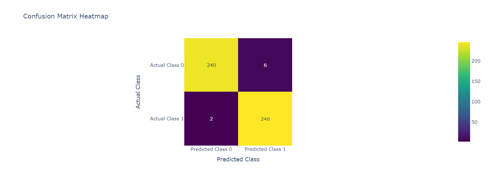
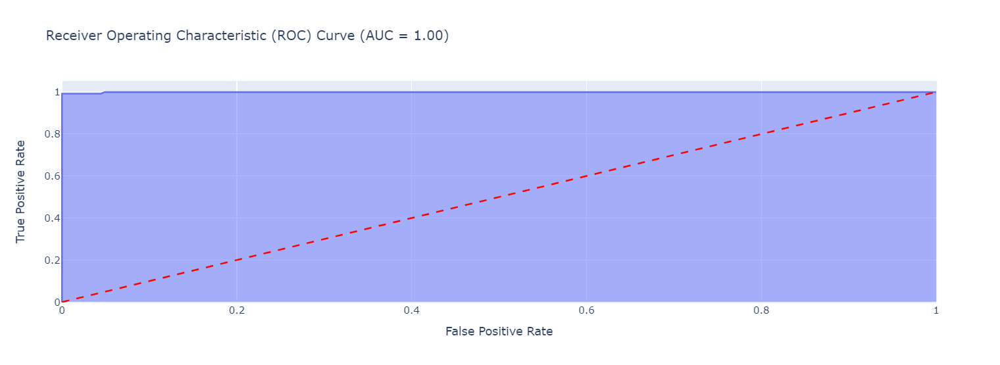
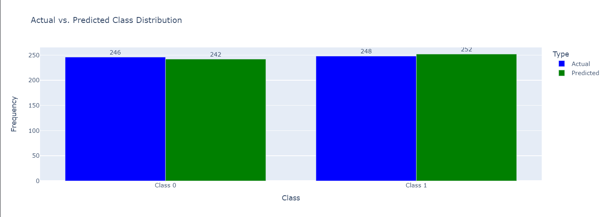

# IBM HR Attrition Prediction

## Overview
The **IBM HR Attrition Prediction** project aims to develop a predictive model to assess employee attrition in the workplace. Using machine learning techniques, we can identify patterns and key factors that influence employee turnover, enabling organizations to implement strategies for retaining talent.

## Features
- Predict employee attrition using a trained Random Forest Classifier.
- Exploratory Data Analysis (EDA) and visual insights on the dataset.
- User-friendly interface built with Streamlit for easy interaction.
- Scalable data preprocessing with StandardScaler for normalization.
- Insights into the importance of various features affecting attrition.

## Table of Contents
1. [Technologies Used](#technologies-used)
2. [Installation](#installation)
3. [Usage](#usage)
4. [Model Training](#model-training)
5. [Results](#results)
6. [Screenshots](#screenshots)
7. [Contributing](#contributing)
8. [License](#license)

## Technologies Used
- Python
- Streamlit
- Scikit-learn
- Pandas
- NumPy
- Matplotlib, Seaborn, Plotly
- Jupyter Notebook

## Installation
To run this project locally, follow these steps:

1. Clone the repository:
   ```bash
   git clone https://github.com/yourusername/IBM_HR_Attrition.git
   cd IBM_HR_Attrition
   ```

2. Create a virtual environment (optional but recommended):
   ```bash
   python -m venv env
   source env/bin/activate  # On Windows use `env\Scripts\activate`
   ```

3. Install required packages:
   ```bash
   pip install -r requirements.txt
   ```

## Usage
To run the Jupyter Notebook file for analysis and prediction:

1. Ensure you have the dataset and the required model files.
2. Run the `Hr_Attrition_with_EDA.ipynb` file in Jupyter Notebook:
   ```bash
   jupyter notebook Hr_Attrition_with_EDA.ipynb
   ```

## Model Training
The model was trained using a dataset from IBM containing various employee attributes. The target variable is whether an employee will leave the company (attrition). The model's performance metrics include accuracy, precision, and F1 score.

## Results
- **Accuracy**: 98.38%
- **Confusion Matrix**: 
  ```
  [[240   6]
   [  2 246]]
  ```
- **F1 Score**: 98.40%
- **Precision**: 97.62%

## Screenshots
Here are some screenshots of the output plots included in the project:

1. **Confusion Matrix Plot**: 
2. **ROC Curve**: 
3. **Actual vs Predicted Distribution**: 

## Contributing
Contributions are welcome! Please fork the repository and create a pull request for any enhancements or bug fixes.

## License
This project is licensed under the MIT License. See the [LICENSE](LICENSE) file for details.
